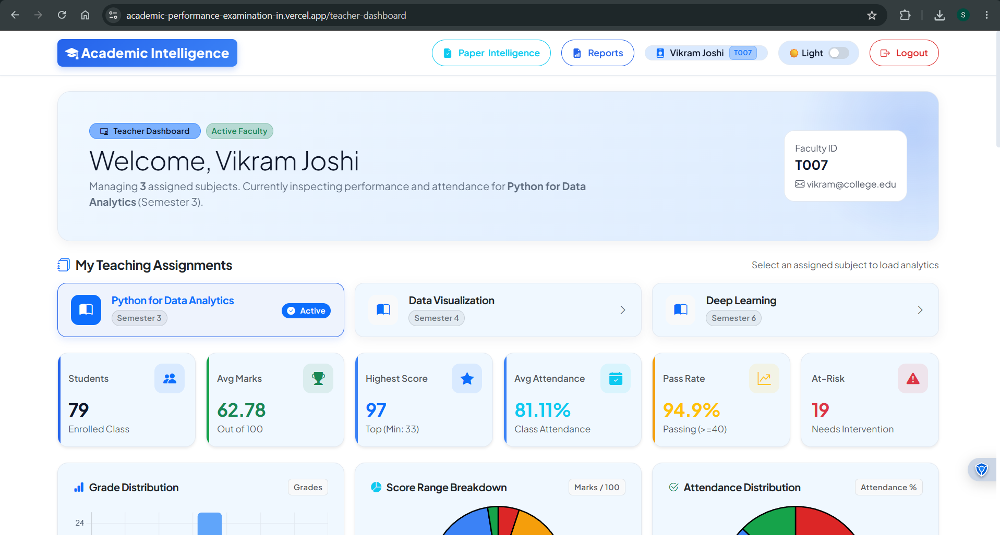
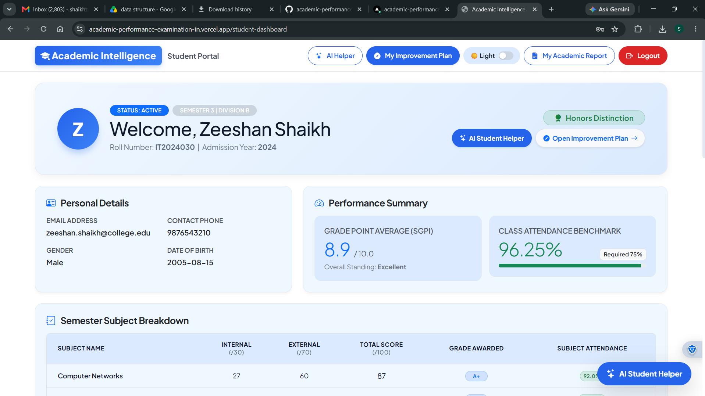
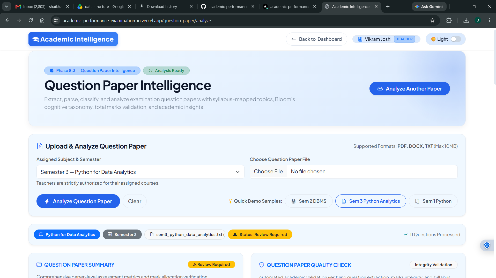

Markdown<div align="center">

# 🎓 Academic Performance & Examination Intelligence System

<p align="center">
  <strong>From Passive Academic Records to Actionable Educational Intelligence</strong>
</p>

<p align="center">
  <a href="https://academic-performance-examination-in.vercel.app/"></a>
  <a href="https://github.com/szeeshanZ123/academic-performance-examination-intelligence-system"></a>
  
  
  
  
</p>

<br>

<p align="center">
  <a href="#-overview">Overview</a> •
  <a href="#-core-architecture">Architecture</a> •
  <a href="#-key-features">Features</a> •
  <a href="#-machine-learning-pipeline">ML Engine</a> •
  <a href="#-question-paper-intelligence">Exam Intelligence</a> •
  <a href="#-installation--setup">Setup</a>
</p>

---

</div>

## 📌 Overview

Traditional Academic Portals stop at **Data Logging**:
$$\text{Student} \longrightarrow \text{Raw Marks} \longrightarrow \text{Static Grade}$$

This system functions as an **Active Decision Engine**:
$$\text{Academic Data} \longrightarrow \text{Pattern Analysis} \longrightarrow \text{ML Risk Prediction} \longrightarrow \text{Intervention Plan}$$

A full-stack platform built with **Flask**, **Pandas**, and **Scikit-Learn** that transforms fragmented attendance, test results, and exam papers into personalized learning roadmaps and class-level intervention KPIs.

---

## 🖥️ Platform Showcase

<div align="center">

| Teacher Analytics Portal | Student Personal Workspace |
| :---: | :---: |
|  |  |
| *Class KPIs, At-Risk Outlier Detection, Subject Breakdown* | *Predictive Trajectory, Subject Mastery, Attendance Alerts* |

</div>

<p align="center">
  
  <br>
  <em>Automated Bloom's Taxonomy & Topic Extraction Pipeline</em>
</p>

---

## 🚀 Key Modules

<table>
<tr>
<td width="33%" valign="top">

### 👨‍🎓 Student Portal
* **Performance Overview:** Real-time GPA and subject score tracking.
* **Trajectory Forecasting:** Scikit-Learn predictions for upcoming finals.
* **Attendance Risk Flags:** Early warnings when falling below target thresholds.
* **Prescriptive Roadmaps:** Targeted topic remediation suggestions.

</td>
<td width="33%" valign="top">

### 👨‍🏫 Teacher Portal
* **Cohort Metrics:** Class pass rates, cohort means, and score distributions.
* **Early-Warning Engine:** Real-time flagging of at-risk students for intervention.
* **Student Drill-Down:** Individual multi-semester trajectory histories.
* **Bulk Export:** Formatted PDF summaries and raw CSV metrics.

</td>
<td width="33%" valign="top">

### 📄 Exam Intelligence
* **Parser Engine:** Fast PDF structure extraction powered by `PyMuPDF`.
* **Marks Extraction:** Automatic scoring and question-boundary parsing.
* **Cognitive Profiling:** Categorization mapped across Bloom’s Taxonomy.
* **Syllabus Coverage:** Automated topic distribution analysis.

</td>
</tr>
</table>

---

## 🧠 Machine Learning & Data Pipeline

The predictive analytics module utilizes an ensemble regression approach to model student final performance outcomes based on historical and operational metrics.

```mermaid
flowchart TD
    A[Raw Student Records] --> B[Data Cleaning & Null Imputation]
    B --> C[Feature Engineering: Attendance Ratio, Historical Mean, Test Deltas]
    C --> D[Stratified Train-Test Split]
    D --> E[Random Forest Regressor Pipeline]
    E --> F[Performance Inference & MAE/RMSE Evaluation]
    F --> G[Intervention & Risk Categorization: Low / Moderate / High]
Engineered IndicatorsInternal Test Trajectory: Rate of score change across continuous assessments.Attendance Weighting: Normalized participation rates against subject difficulty.Historical Variability: Deviation analysis across previous semester finals.📄 Question Paper Intelligence PipelineCode snippetflowchart LR
    PDF[PDF Upload] --> OCR[PyMuPDF Parsing]
    OCR --> QExtract[Question Boundary Segmentation]
    QExtract --> Marks[Marks & Weightage Detection]
    Marks --> Bloom[Bloom's Taxonomy Classification]
    Bloom --> Report[Curriculum Balance Visualizer]
Cognitive Mapping EngineCognitive LevelFocus AreaExtraction Indicator🟢 RememberRecall & TermsDefine, List, State, Identify🔵 UnderstandConceptual GraspExplain, Summarize, Describe🟡 ApplyPractical ExecutionSolve, Compute, Implement🟠 AnalyzeStructural LogicDifferentiate, Compare, Deconstruct🔴 EvaluateCritical DefenseJustify, Assess, Validate🟣 CreateSynthesis & DesignDesign, Construct, Formulate🏗️ System ArchitectureCode snippetgraph TD
    subgraph Client Layer
        UI[Responsive UI: Bootstrap 5, Chart.js, HTML5]
    end

    subgraph Application Layer
        App[Flask Core Application Controller]
        Auth[Role-Based Authentication Engine]
        Analytics[Pandas / NumPy Calculation Engine]
        MLEngine[Scikit-Learn Inference Pipeline]
        DocEngine[PyMuPDF Document Parser]
    end

    subgraph Data & Storage Layer
        DataStore[(Academic Records CSV / Relational DB)]
        Reports[ReportLab PDF Generation Engine]
    end

    UI <-->|REST Requests / Session Auth| App
    App --> Auth
    App --> Analytics
    App --> MLEngine
    App --> DocEngine
    Analytics <--> DataStore
    MLEngine <--> DataStore
    App --> Reports
🛠️ Tech StackDomainTechnologiesBackend & Routing Machine Learning & Math  Frontend & Visuals  Parsing & Reporting Deployment⚙️ Installation & SetupPrerequisitesPython 3.10+GitStep-by-StepClone the repository:Bashgit clone [https://github.com/szeeshanZ123/academic-performance-examination-intelligence-system.git](https://github.com/szeeshanZ123/academic-performance-examination-intelligence-system.git)
cd academic-performance-examination-intelligence-system
Initialize virtual environment:Bash# Windows
python -m venv .venv
.venv\Scripts\activate

# Linux / macOS
python3 -m venv .venv
source .venv/bin/activate
Install dependencies:Bashpip install --upgrade pip
pip install -r requirements.txt
Launch development server:Bashpython app.py
Navigate to http://127.0.0.1:5000 in your browser.🧪 Verification & Testing ScopeAccess Control: Verified RBAC route protection ensuring students cannot query class-wide records.Model Inference: Stress-tested prediction pipelines against edge values (e.g., zero attendance, missing historical semesters).Document Extraction: Validation against varied examination paper formatting (single-column, tabular, multi-section).Data Flow Integrity: Verification that dynamic student filter queries match underlying CSV/database aggregates.🔐 Production Readiness Checklist[ ] Transition from CSV data storage to a normalized relational database (PostgreSQL / SQLite).[ ] Implement password hashing using bcrypt or Argon2.[ ] Implement CSRF tokens for all state-changing endpoints.[ ] Move session storage from client cookies to secure server-side caching (Redis).[ ] Establish strict API rate-limiting to prevent brute-force attacks.👨‍💻 AuthorZeeshan ShaikhData Science • Machine Learning • Full-Stack Development

